# TaskMaster - сервис для размещения заданий

Первое, что видит пользователь, когда заходит на сайт, это начальную страницу. 

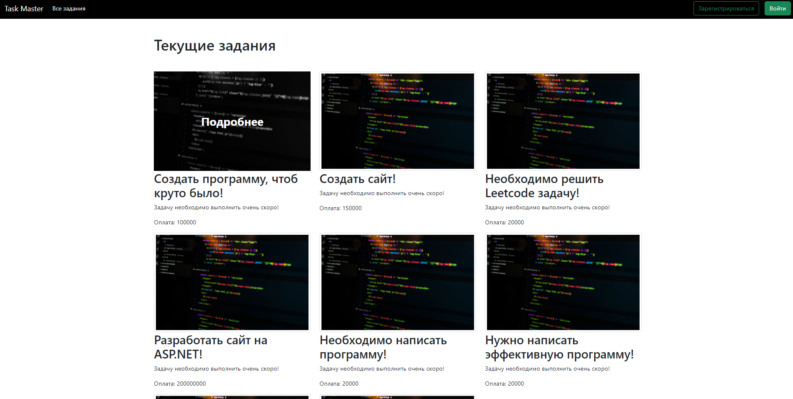

На главной странице отбражаются все задания, которые только есть. В верхней части отображаются задачи, которые предстоит выполнить, они обозначаются заголовком **Текущие задания**. При наведении на картинку любого задания, появляется анимация и предложение узнать подробную информацию о конкретном задании. 

Также подробную информацию можно узнать и о любом задании, срок выполнения которого уже истёк. Эти задания находятся под заголовком **Прошедшие задания**.

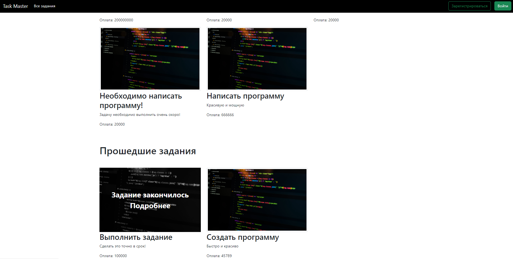

Чтобы узнать подробную информацию о любом задании, нужно назать на него, после этого пользователь попадает на новую страницу.

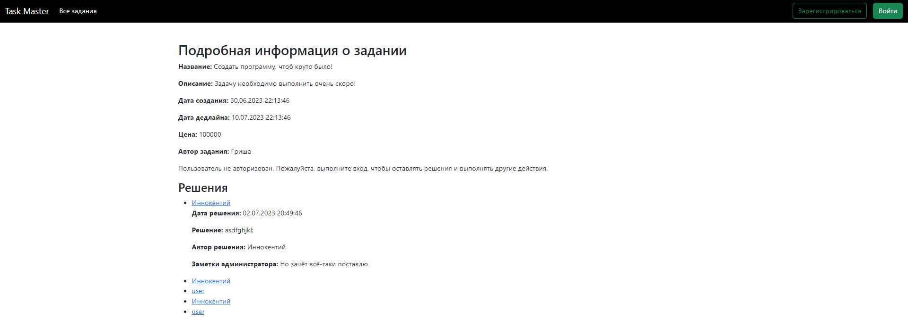

А вот это страница задания с истёкшим сроком:
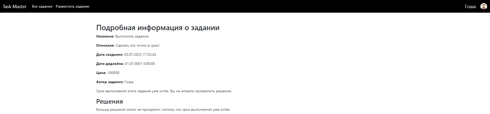

Здесь можно прочитать описание задания, увидеть, когда он был размещён, срок его выполнения, сколько заказчик заплатит за него и кто является автором этого задания.

Так как в данный момент пользователь не авторизован, функционал страницы ограничен. Всего на сервисе есть два типа аккаунта: администратор и обычный пользотель. На данный момент добавлены два администратора - это Гоша и Гриша. Права администратора были выданы им сразу, никто больше их не имеет и получить не может.

Произведём авторизацию в качестве обычного пользователя. Для этого нажмём на кнопку **Войти** в правом верхнем углу. 

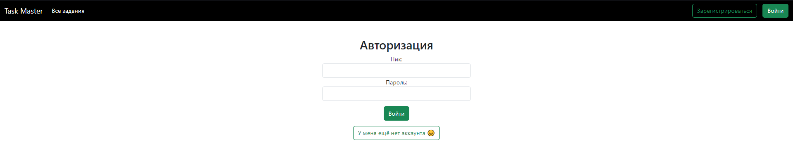

В случае, если пользователь ещё не имеет аккаунта, он может спокойно перейти на страницу регистрации прямо из страницы авторизации, либо нажав на кнопку **Зарегистрироваться** в правом верхнем углу - эти действия аналогичны.

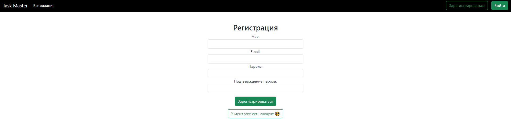

Допустим произошла авторизация обычного пользователя. Так будет выглядеть страница с подробной информацией о задании:

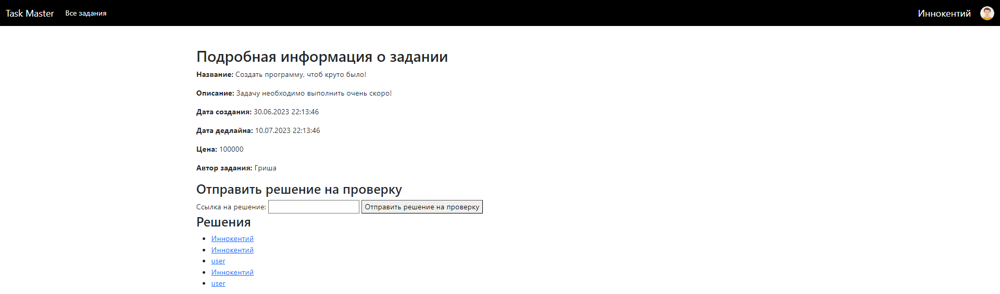

Теперь у нас есть возможность отправлять решение на проверку. В данном случае решением будет текст, либо ссылка, например, на GitHub. Для отправки ответа необходимо нажать на соответвующую кнопку справа.

Внизу располагается область **Решения**. Каждый может посмотреть уже добавленные другими пользователями решения. В данный момент отображаются лишь имена пользователей, чьи решения здесь есть. Однако можно нажать на них: 

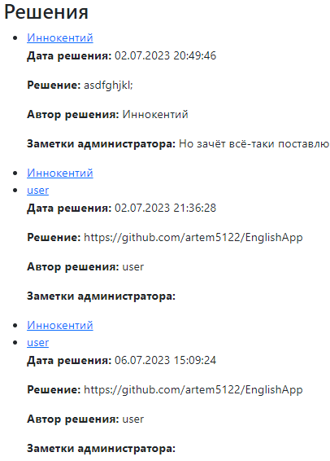

Теперь давайте посмотрим, как выглядит интерфейс при авторизации в качестве администратора. Для этого необходимо сначала выйти из текущего аккаунта. Нажмём на иконку пользователя и в выпадающем меню выберем **Выйти**.

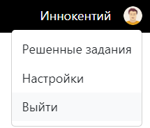

Вот, что видит администратор, когда заходит на страницу с заданием:

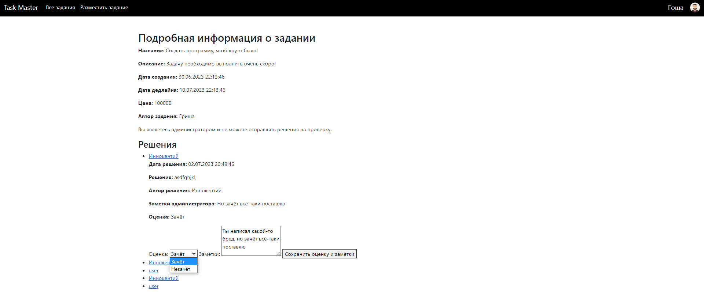

Разумеется, администратор не может прикреплять ответ, о чём нам сообщает соответствующая надпись, однако он может ставить оценки - **зачёт/незачёт** каждому решению, а также оставлять заметки к ответу.

Помимо изменения функционала на странице задания, добавилась кнопка **Разместить задание** на верхней панели. Давайте перейдём туда.

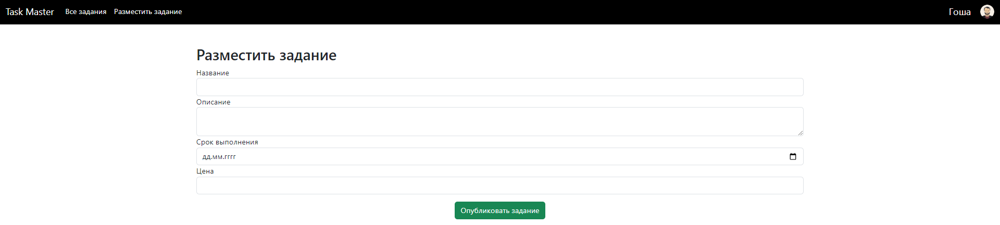

Администратору доступно задать название, описание, срок выполнения и цену нового задания. За дату создания задания берётся, разумеется, текущая. Дату дедлайна можно удобно задать с помощью выплывающего календарика. Дата дедлайна - минимум завтрашний день, на сегодня поставить не получится. 

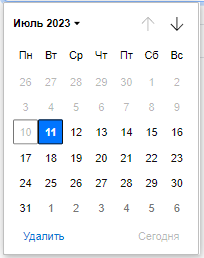

# Техническое описание
Сайт написан на ASP.NET. Для разработки использовалась архитектура MVC. Это означает, что приложение использует схему разделения данных и управляющей логики на три отдельных компонента: модель, представление и контроллер.

Безусловно всё это приложение можно было написать в нескольких файлах, однако такая архитектура позволяет, быстро и удобно масштабироваться и видоизменять ту или иную часть сайта, потому что можно модифицировать одну часть приложения, абсолютно не затрагивая другую.

### Модель
В приложении были реализованы 3 модели:
+ **Task**
+ **Solution**
+ **Account**

Каждая из этих моделей - это обычный класс, которые имеют поля для удобного и подробного описания той или иной сущности. Например, у класса **Task** есть поля Id, Title, Description, CreatedDate, DeadlineDate, Price и TaskAuthour.

Это все поля, которые мне понадобились для подробного описания задания. Соответственно в **Solution** и **Account** реализованы свои поля в соответствии с логикой приложения.

Важно отметить, что все эти три класса так или иначе связаны между собой определёнными полями. То есть экземпляр класса **Solution** описывает к какому заданию **Task** оно относится и так далее.

### Контроллер
Было реализовано несколько контроллеров: **AccountController**, **HomeController**, **NewTaskController** и **TaskController**. Каждый из них отвечает за обработку той или иной информации, такой как регистрация или авторизация пользователя, получение подробной информации о конкретном задании, вывод списка всех заданий так далее и тому подобное.

Эти элементы выступают связующим звеном между моделью и представлением.

### Представление
Это простой вывод информации на экран, либо её сбор. Эти элементы выдают пользователю графический интерфейс, с которым от спокойно взаимодействует. Представления написаны на языке Razor. Это такой язык, выпущенный компанией Microsoft в 2011 году, который совмещает в себе HTML разметку и полноценный C#.

В представлениях были применены различные стили, были подключены библиотеки Bootstrap. Большинство элементов сайта анимированы.

## База данных
Для создания базы данных испольовался фреймворк Entity Framework Core. Он позволяет автоматически создавать и изменять базу данных на основе уже созданных сущностей(моделей). Для этого необходимо прописать лишь несколько команд в консоли и вуаля! Удобно. 

Моя база данных реализована на MS SQL. Было создано три таблицы на основе тех трёх моделей, которые связаны между собой внешними ключами.  

## Докер
Проект состоит из двух отдельных контейнеров - для БД и для самого ASP.NET приложения. Запускать команды нужно именно в таком порядке:

docker pull artem5122/database-image1:latest

docker pull artem5122/taskmaster-image:latest

docker run --name database-container -e "ACCEPT_EULA=Y" -e "MSSQL_SA_PASSWORD=1StrongPwd!!" -p 1433:1433 -d artem5122/database-image1:latest /opt/mssql/bin/sqlservr

docker run -p 8000:80 --name taskmaster-container --link database-container artem5122/taskmaster-image
